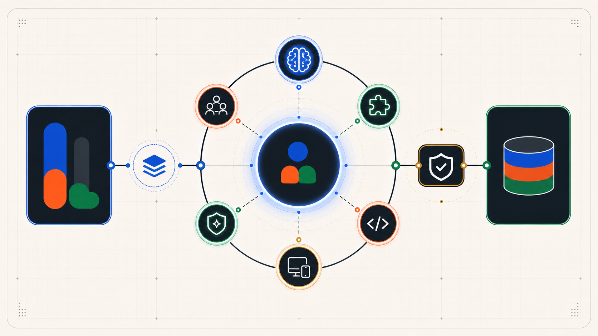

# Team RAM

**A standalone, governed multi-agent software-delivery harness for OpenCode, Claude Code, and Codex.**

Team RAM turns a software request into a controlled work graph: scope the intent, hydrate repository context, dispatch bounded specialist lanes in the background, reconcile their results, review the actual change, and report command-level evidence. Provider presets change models without changing role authority or delivery gates.

<p align="center">
  
</p>

<p align="center">
  <a href="LICENSE"></a>
  <a href="https://github.com/Allura-Ecosystem/allura-team-ram/actions"></a>
  <a href="https://bun.sh"></a>
</p>

## What the harness does

- **Background orchestration:** Brooks decomposes work and can dispatch independent read-only or specialist tasks concurrently, then reconciles results before the writer proceeds.
- **Context-first routing:** Jobs establishes intent and boundaries; Scout discovers the live code, instructions, risks, and validation commands before implementation.
- **Specialist lanes:** Woz owns implementation while Pike, Fowler, Bellard, Carmack, Knuth, and Hightower apply interface, maintainability, diagnostics, performance, data, and infrastructure expertise.
- **Review before completion:** reviewers inspect the real diff and artifacts; mutation, deployment, and self-modification boundaries retain human approval.
- **Evidence, not completion theater:** a task is complete only with executed checks, concrete outcomes, and explicit blockers or exclusions.
- **Role-stable presets:** Ollama, OpenAI, Anthropic, and mixed presets change model assignments while keeping permissions and lane responsibilities intact.
- **Optional governed memory:** Allura Memory can add cross-session retrieval and evidence traces. Without it, the core orchestration and review flow remains usable.

## Delivery flow

```text
Request
  -> Jobs: intent and acceptance boundaries
  -> Brooks: plan and background work graph
  -> Scout: repository context packet
  -> Specialist lane(s): analysis or implementation
  -> Pike/Fowler and domain review: inspect the actual result
  -> Verification: run declared checks and collect evidence
  -> Human gate: approve protected or destructive transitions
```

The harness supports interactive `DAY_BUILD`, bounded unattended `NIGHT_BUILD`, and the six-step `AUTO` contract (`Observe -> Choose -> Act -> Verify -> Record -> Stop`). None of these modes grants permission to cross destructive, production, credential, or governance boundaries silently.

## Quick start

### 1. Clone and verify the canonical source

```bash
git clone https://github.com/Allura-Ecosystem/allura-team-ram.git
cd allura-team-ram
bun install
bun run validate:export
bun run lint
bun run typecheck
bun test
```

### 2. Install into a project

The package CLI performs no post-install mutation. Scaffolding is explicit:

```bash
# From a published package
bunx @allura/team-ram-harness init --target /path/to/project --runtime opencode

# Or from this checkout
node ./bin/team-ram.mjs init --target /path/to/project --runtime opencode
```

Use `--runtime claude`, `--runtime codex`, or `--runtime all` for another public runtime surface. Existing files are preserved unless `--force` is supplied.

### 3. Select models

```bash
./scripts/apply-preset.sh --dry-run
./scripts/apply-preset.sh ollama
./scripts/apply-preset.sh --check
```

Preset application edits runtime configuration. Review the dry run first, especially in a host repository with local provider settings.

### 4. Start a governed task

In the selected agent runtime, invoke the orchestrator or a command such as:

```text
@brooks add validation to the account import flow and prove it with tests
/start-session
/party review this proposed API from interface, data, and operations lanes
/auto fix the failing parser test without changing the public schema
```

Expect context discovery before edits, one accountable writer, specialist review, and a final evidence summary.

For detailed setup and host-project options, see [Installation](docs/installation.md). For models, permissions, memory, and service settings, see [Configuration](docs/configuration.md).

## Specialist lanes

| Lane | Agent | Accountable behavior |
|---|---|---|
| Architecture/orchestration | Brooks | Owns conceptual integrity, work decomposition, delegation, and reconciliation; does not replace the writer |
| Intent | Jobs | Clarifies goal, acceptance criteria, scope, and stop conditions |
| Context/recon | Scout | Read-only discovery and risk/context packet creation |
| Implementation | Woz | Primary writer; implements and runs targeted checks |
| Interface | Pike | Read-only API and surface-area review |
| Maintainability | Fowler | Reviews structure, types, lint, and safe refactoring |
| Diagnostics | Bellard | Reproduces and measures before proposing a fix |
| Performance | Carmack | Optimizes only measured bottlenecks |
| Data | Knuth | Reviews schema, migration, query, and data-integrity changes |
| Infrastructure | Hightower | Reviews CI/CD, containers, deployment, and observability |
| Memory companion | Bahari | Curates optional Allura Memory interactions; not a software-delivery writer |

The canonical role definitions live in this repository. Runtime mirrors are validated by the repository tooling.

## Configuration at a glance

| Surface | Purpose |
|---|---|
| `.opencode/team-ram-presets.jsonc` | Canonical model presets and fallback chains |
| `.opencode/agent/`, `.opencode/command/`, `.opencode/skills/` | OpenCode public harness source |
| `.claude/` and `.claude-plugin/` | Claude Code runtime and plugin surfaces |
| `.codex/` and `.codex-plugin/` | Codex runtime and plugin surfaces |
| `.opencode/config/agent-metadata.json` | Lane metadata and routing permissions |
| `.mcp.json` | Optional MCP wiring; hosts must supply their own reachable services |
| `.env.example` | Optional HTTP and memory integration variables |
| `PUBLIC_EXPORT.json` | Exact public export contract by agents, commands, skills, config, runtime, and docs |
| `SOURCE.json` | Canonical ownership and downstream generation contract |

`opencode.json` is a runnable repository example, not the canonical cross-repository export contract. Host-specific provider or credential configuration should stay local.

## Optional HTTP service

The Bun service exposes authenticated invocation and governed lifecycle endpoints for external orchestrators:

```bash
cp .env.example .env
bun run service
curl http://localhost:7654/health
```

Set `HARNESS_API_KEY` before invoking authenticated endpoints. See [`.opencode/SERVICES.md`](.opencode/SERVICES.md) for the live endpoint contract.

## Standalone and ecosystem modes

Team RAM is independently installable and remains useful with no Allura Memory server and no sibling repository checkout.

- **Standalone:** static/preset routing, repository context, specialist delegation, review gates, local/runtime evidence. Memory lookups and durable trajectory promotion are unavailable and must be reported as degraded rather than fabricated.
- **With Allura Memory:** optional tenant-scoped retrieval, trajectory/evidence persistence, and curator workflows become available through the configured MCP/API boundary.
- **With allura-plugins:** this repository remains canonical. `allura-plugins` consumes a pinned generated export; downstream copies are not edited as source.
- **Durham and Mortagate:** domain/product teams consume Team RAM as a delivery harness. Their policy, tenant, data, and release authority remain in those products; Team RAM does not inherit it.

See [Ecosystem relationships and degraded behavior](docs/ecosystem-relationships.md) and [`SOURCE.json`](SOURCE.json).

## Public export and releases

`PUBLIC_EXPORT.json` is the machine-readable allowlist for package source. It defines exactly which agent, command, skill, configuration, runtime, and documentation files are public.

```bash
bun run validate:export
bun run export:public -- ./dist/public-export
```

CI rejects stale patterns, unclassified files under public roots, package/manifest drift, or an authority declaration that no longer names this repository. A future `allura-plugins` update should pin a commit SHA, run the export, and record generation provenance; it must not become a second editable authority.

## Documentation

- [Installation](docs/installation.md)
- [Configuration](docs/configuration.md)
- [Ecosystem relationships and degraded behavior](docs/ecosystem-relationships.md)
- [Agents and routing](docs/agents.md)
- [Presets](docs/presets.md)
- [Dual-runtime guide](docs/dual-runtime.md)
- [Quick reference](docs/quick-reference.md)
- [Testing](docs/TESTING.md)
- [Architecture](ARCHITECTURE.md)
- [Contributing](CONTRIBUTING.md)

## Canonical source

This repository is the canonical standalone source for Team RAM. Ownership and export semantics are declared in [`SOURCE.json`](SOURCE.json); the public package boundary is declared in [`PUBLIC_EXPORT.json`](PUBLIC_EXPORT.json). Historical planning records may describe earlier ownership arrangements, but they do not override these machine-readable contracts.

MIT licensed. See [LICENSE](LICENSE).
